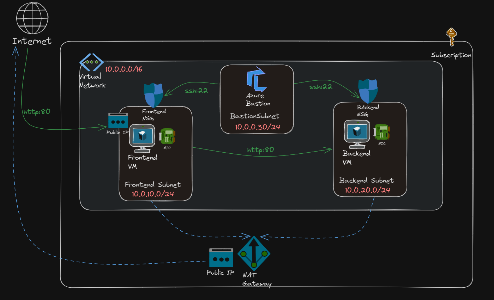

# dive-into-azure-networks

Series of sessions with hands-on Demos to dive into Azure Networks.

## Part 1

* **Agenda**
  * Azure Regions and Availability Zones.
  * Azure Virtual Networks and Subnets.
  * Outbound connectivity to the internet.
  * Inbound connectivity from the internet.
  * Controlling Vnet traffic (NSGs).
  * Access private VMs (Azure Bastion).

* **Demo Diagram**

